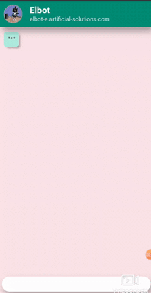

# Elbot's Chat Box

  

A demo is available as a heroku app at: https://chatwithelbot.herokuapp.com/

Elbot is an eloquent and witty bot developed by [Artificial Solutions](https://www.artificial-solutions.com/). Didn't like much its original UI so I implemented my own using React and Redux.

## Run this project locally

Although a demo is available as a [Heroku app](https://chatwithelbot.herokuapp.com/) you might want to run this project locally.

In the project directory, you can run:

### `yarn start`

Runs the app in the development mode. 
Open [http://localhost:3000](http://localhost:3000) to view it in the browser.

## Production build with docker

Build image:

## `docker build -t elbot .`

Mount image:

## `docker run -p 5000:5000 -it elbot`

Open [http://localhost:5000](http://localhost:5000) to view it in the browser.

## TODO

 - Turn it into a PWA with push notifications, so Elbot will send you messages when you least expected (or when you most need it).
 - Deploy to Heroku.
 - Integrate several other bots.
 - Support to message-embbeded html tags, sometimes Elbot responds with some HTML.
 - Enhance palette
 - Write tests
